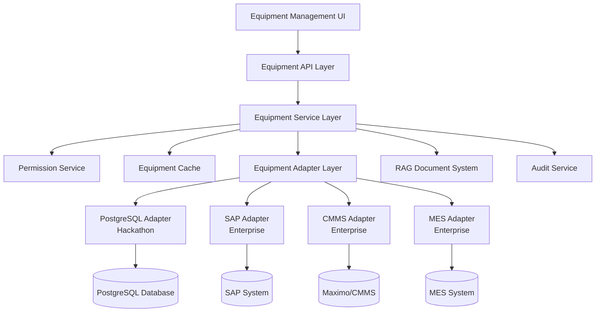

# Equipment Management System Design

## Overview

The Equipment Management System provides a unified interface for accessing industrial equipment information across multiple enterprise systems. The system follows a read-only integration pattern, federating data from various sources while maintaining enterprise security and permission structures. The architecture supports both hackathon demonstration (PostgreSQL-based) and future enterprise deployment (multi-adapter integration).

## Architecture

### High-Level Architecture



### Layered Architecture

**Presentation Layer:**
- Equipment catalog interface
- Equipment detail views
- Search and filtering components
- Status dashboard

**API Layer:**
- RESTful equipment endpoints
- Authentication and authorization
- Request validation and response formatting

**Service Layer:**
- Equipment business logic
- Data aggregation and transformation
- Permission enforcement
- Caching strategy

**Adapter Layer:**
- Enterprise system connectors
- Data source abstraction
- Protocol-specific implementations

**Data Layer:**
- Multiple enterprise systems
- Local caching database
- Document management integration

## Components and Interfaces

### Equipment Service

**Core Equipment Service:**
```typescript
interface EquipmentService {
  searchEquipment(criteria: SearchCriteria, user: User): Promise<Equipment[]>
  getEquipmentById(id: string, user: User): Promise<Equipment | null>
  getEquipmentStatus(id: string, user: User): Promise<EquipmentStatus>
  getMaintenanceHistory(id: string, user: User): Promise<MaintenanceRecord[]>
  getRelatedDocuments(id: string, user: User): Promise<Document[]>
}
```

**Equipment Repository Interface:**
```typescript
interface EquipmentRepository {
  findBySearchCriteria(criteria: SearchCriteria): Promise<Equipment[]>
  findById(id: string): Promise<Equipment | null>
  findByLocation(location: string): Promise<Equipment[]>
  findByType(type: string): Promise<Equipment[]>
}
```

### Equipment Adapter Pattern

**Base Equipment Adapter:**
```typescript
abstract class EquipmentAdapter {
  abstract connect(): Promise<void>
  abstract disconnect(): Promise<void>
  abstract getEquipment(id: string): Promise<RawEquipmentData>
  abstract searchEquipment(criteria: SearchCriteria): Promise<RawEquipmentData[]>
  abstract getMaintenanceHistory(equipmentId: string): Promise<RawMaintenanceData[]>
  abstract getEquipmentStatus(id: string): Promise<RawStatusData>
  abstract healthCheck(): Promise<AdapterHealth>
}
```

**PostgreSQL Adapter (Hackathon):**
```typescript
class PostgreSQLEquipmentAdapter extends EquipmentAdapter {
  // Direct database queries for hackathon demo
  // Simulates enterprise complexity with realistic data
}
```

**Enterprise Adapters (Future):**
```typescript
class SAPEquipmentAdapter extends EquipmentAdapter {
  // SAP RFC/OData integration
}

class MaximoEquipmentAdapter extends EquipmentAdapter {
  // Maximo REST API integration
}
```

### Permission Service

**Permission Interface:**
```typescript
interface PermissionService {
  canAccessEquipment(user: User, equipmentId: string): Promise<boolean>
  filterEquipmentList(user: User, equipment: Equipment[]): Promise<Equipment[]>
  getAccessibleFields(user: User, equipment: Equipment): Promise<string[]>
  getUserPermissions(user: User): Promise<EquipmentPermissions>
}
```

**Role-Based Access Control:**
```typescript
interface EquipmentPermissions {
  canViewBasicInfo: boolean
  canViewTechnicalSpecs: boolean
  canViewMaintenanceHistory: boolean
  canViewCostData: boolean
  canViewSafetyData: boolean
  accessibleLocations: string[]
  accessibleEquipmentTypes: string[]
}
```

### Caching Strategy

**Equipment Cache Interface:**
```typescript
interface EquipmentCache {
  getEquipment(id: string): Promise<Equipment | null>
  setEquipment(id: string, equipment: Equipment, ttl: number): Promise<void>
  invalidateEquipment(id: string): Promise<void>
  getEquipmentStatus(id: string): Promise<EquipmentStatus | null>
  setEquipmentStatus(id: string, status: EquipmentStatus, ttl: number): Promise<void>
}
```

**Cache TTL Strategy:**
- Equipment Master Data: 24 hours (rarely changes)
- Equipment Status: 5 minutes (frequently changes)
- Maintenance History: 1 hour (moderate changes)
- Equipment Specifications: 12 hours (occasionally changes)

## Data Models

### Core Equipment Model

```typescript
interface Equipment {
  id: string
  name: string
  description: string
  equipmentNumber: string
  category: EquipmentCategory
  type: string
  manufacturer: string
  model: string
  serialNumber: string
  location: EquipmentLocation
  specifications: EquipmentSpecifications
  status: EquipmentStatus
  installationDate: Date
  lastMaintenanceDate: Date
  nextMaintenanceDate: Date
  criticality: 'LOW' | 'MEDIUM' | 'HIGH' | 'CRITICAL'
  operationalState: 'OPERATIONAL' | 'MAINTENANCE' | 'OFFLINE' | 'ALARM'
  tags: string[]
  customFields: Record<string, any>
}
```

### Equipment Location Hierarchy

```typescript
interface EquipmentLocation {
  plant: string
  area: string
  line: string
  station: string
  functionalLocation: string
  coordinates?: {
    latitude: number
    longitude: number
  }
}
```

### Equipment Specifications

```typescript
interface EquipmentSpecifications {
  technicalSpecs: Record<string, any>
  operatingParameters: {
    maxTemperature?: number
    maxPressure?: number
    powerRating?: number
    voltage?: number
    frequency?: number
  }
  safetyParameters: {
    safetyClass: string
    hazardousArea: boolean
    lockoutTagout: boolean
    permitRequired: boolean
  }
  performanceMetrics: {
    efficiency?: number
    capacity?: number
    throughput?: number
  }
}
```

### Maintenance History

```typescript
interface MaintenanceRecord {
  id: string
  equipmentId: string
  workOrderNumber: string
  workType: 'PREVENTIVE' | 'CORRECTIVE' | 'PREDICTIVE' | 'EMERGENCY'
  description: string
  scheduledDate: Date
  completedDate: Date
  duration: number
  technician: string
  status: 'SCHEDULED' | 'IN_PROGRESS' | 'COMPLETED' | 'CANCELLED'
  partsUsed: MaintenancePart[]
  laborHours: number
  cost: number
  notes: string
}
```

### Equipment Status

```typescript
interface EquipmentStatus {
  equipmentId: string
  operationalState: 'OPERATIONAL' | 'MAINTENANCE' | 'OFFLINE' | 'ALARM'
  lastUpdated: Date
  alarms: EquipmentAlarm[]
  performanceMetrics: {
    efficiency: number
    availability: number
    reliability: number
  }
  realTimeData: Record<string, any>
}
```

## Correctness Properties

*A property is a characteristic or behavior that should hold true across all valid executions of a system-essentially, a formal statement about what the system should do. Properties serve as the bridge between human-readable specifications and machine-verifiable correctness guarantees.*

### Property Reflection

After analyzing all acceptance criteria, several properties can be consolidated to eliminate redundancy:

- Properties related to data retrieval and transformation can be combined into comprehensive data federation properties
- Permission-related properties can be consolidated into access control properties
- Search and filtering properties can be combined into comprehensive search properties
- Status and monitoring properties can be unified into equipment status properties

### Core Properties

**Property 1: Multi-Source Data Federation**
*For any* equipment request, when multiple enterprise systems are configured, all available data sources should be queried and their responses should be transformed into a unified equipment model format
**Validates: Requirements 1.1, 1.2, 1.4**

**Property 2: Fallback Data Availability**
*For any* equipment request, when enterprise systems are unavailable, cached data should be returned with appropriate freshness indicators and the system should remain functional
**Validates: Requirements 1.3**

**Property 3: Audit Trail Completeness**
*For any* equipment data access, an audit log entry should be created containing user information, accessed equipment, timestamp, and operation type
**Validates: Requirements 1.5, 2.5**

**Property 4: Permission-Based Access Control**
*For any* user and equipment combination, the system should only return equipment data if the user has appropriate permissions, and should filter sensitive fields based on user role
**Validates: Requirements 2.1, 2.2, 2.3, 2.4**

**Property 5: Search Performance and Completeness**
*For any* valid search criteria, the system should return matching results within 2 seconds and include all required information (status, specifications, location)
**Validates: Requirements 3.1, 3.2, 3.3, 3.4**

**Property 6: Search Result Enhancement**
*For any* search query that returns no results, the system should provide alternative search suggestions or similar equipment recommendations
**Validates: Requirements 3.5**

**Property 7: Equipment Detail Completeness**
*For any* equipment detail request, the response should include complete equipment information, maintenance history, related documents, current status, and specifications
**Validates: Requirements 4.1, 4.2, 4.3, 4.4, 4.5**

**Property 8: Document Integration Consistency**
*For any* equipment with related documents, all documents should be displayed with proper categorization and links should open in the RAG chat interface with equipment context
**Validates: Requirements 5.1, 5.2, 5.3**

**Property 9: Document Association Immediacy**
*For any* document upload and equipment association, the relationship should be immediately reflected in equipment details and document listings
**Validates: Requirements 5.4, 5.5**

**Property 10: Status Display and Updates**
*For any* equipment status change, the display should be updated within 5 minutes and should properly categorize status as operational, maintenance required, offline, or alarm
**Validates: Requirements 6.1, 6.2, 6.3, 6.4, 6.5**

**Property 11: Maintenance History Accuracy**
*For any* equipment maintenance history, records should be displayed in chronological order with complete information including work orders, dates, descriptions, technician information, and calculated metrics
**Validates: Requirements 7.1, 7.2, 7.4, 7.5**

**Property 12: Maintenance History Filtering**
*For any* maintenance history filter criteria (date range, work type, completion status), the filtered results should only include records matching all specified criteria
**Validates: Requirements 7.3**

**Property 13: Adapter Architecture Extensibility**
*For any* new enterprise system adapter configuration, the system should be able to integrate the new adapter without code changes and support its specific authentication and data synchronization requirements
**Validates: Requirements 8.1, 8.2, 8.3, 8.4**

**Property 14: System Health Monitoring**
*For any* configured enterprise system, the system should provide health check status and monitoring information indicating connectivity and operational status
**Validates: Requirements 8.5**

## Error Handling

### Enterprise System Failures

**Connection Failures:**
- Implement circuit breaker pattern for enterprise system connections
- Fallback to cached data with staleness indicators
- Retry logic with exponential backoff
- Health check monitoring with alerting

**Data Inconsistencies:**
- Validate data from enterprise systems before processing
- Log data quality issues for investigation
- Provide partial results when some systems fail
- Clear error messages indicating which systems are unavailable

**Permission Failures:**
- Graceful handling of permission service outages
- Fallback to cached permission data when possible
- Clear error messages for access denied scenarios
- Security audit logging for all permission failures

### Performance Degradation

**Search Timeout Handling:**
- Implement search timeouts with partial results
- Progressive search with result streaming
- Cache frequently searched equipment
- Search suggestion fallbacks for failed searches

**Large Dataset Handling:**
- Pagination for large equipment lists
- Lazy loading for equipment details
- Background data synchronization
- Memory management for large maintenance histories

### Data Quality Issues

**Missing Data Handling:**
- Default values for missing equipment fields
- Clear indicators for incomplete data
- Graceful degradation when specifications are missing
- User-friendly messages for data gaps

**Data Validation:**
- Input validation for all equipment data
- Data type checking and conversion
- Range validation for numeric fields
- Format validation for equipment identifiers

## Testing Strategy

### Dual Testing Approach

The testing strategy combines unit tests for specific scenarios with property-based tests for comprehensive coverage:

**Unit Tests:**
- Test specific equipment search scenarios
- Test permission edge cases and error conditions
- Test enterprise adapter connection failures
- Test document association workflows
- Test maintenance history calculations
- Test status update mechanisms

**Property-Based Tests:**
- Test data federation across multiple mock enterprise systems
- Test permission filtering with randomly generated user roles and equipment
- Test search functionality with various criteria combinations
- Test caching behavior with random system availability patterns
- Test adapter extensibility with different configuration scenarios
- Test audit logging completeness across all operations

### Property Test Configuration

Each property-based test will run a minimum of 100 iterations to ensure comprehensive coverage. Tests will be tagged with references to their corresponding design properties:

- **Feature: equipment-management, Property 1**: Multi-source data federation testing
- **Feature: equipment-management, Property 4**: Permission-based access control testing
- **Feature: equipment-management, Property 5**: Search performance and completeness testing
- **Feature: equipment-management, Property 10**: Status display and update testing

### Integration Testing

**Enterprise System Integration:**
- Mock enterprise systems for testing different data formats
- Test adapter configuration and deployment
- Test authentication with different enterprise systems
- Test data synchronization and caching strategies

**RAG System Integration:**
- Test document association and retrieval
- Test equipment context in chat interface
- Test document upload and categorization
- Test search integration between equipment and documents

**Performance Testing:**
- Load testing with large equipment datasets
- Concurrent user testing for search and detail views
- Memory usage testing with extensive maintenance histories
- Response time testing under various system loads

### Test Data Management

**Realistic Test Data:**
- Industrial equipment from various manufacturers
- Complex location hierarchies (plants, areas, lines)
- Comprehensive maintenance histories
- Various equipment types (PLCs, pumps, conveyors, sensors)
- Different permission scenarios and user roles

**Data Generation:**
- Automated generation of equipment test data
- Maintenance history simulation with realistic patterns
- Document association test data
- User permission matrix for testing access control