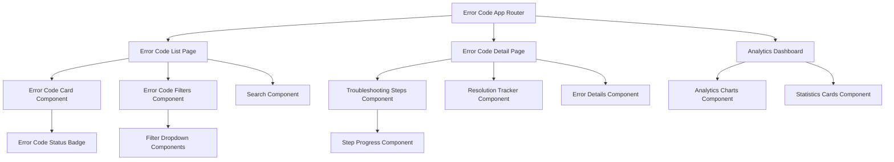
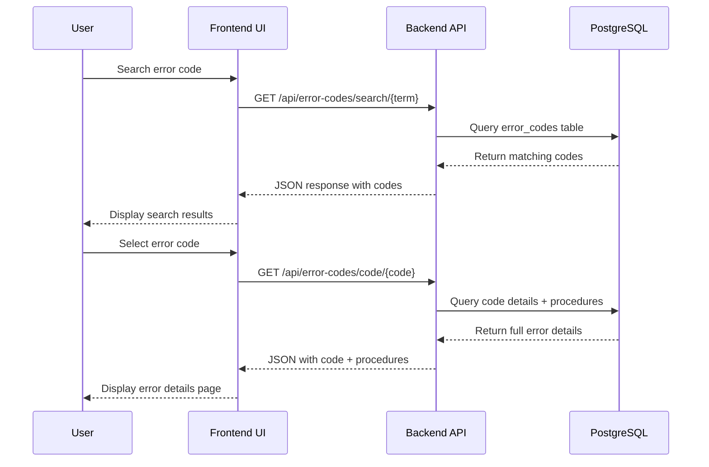

# Design Document: Error Code Frontend System

## Overview

The Error Code Frontend System provides a comprehensive web interface for industrial error code management, built on React/Next.js to integrate seamlessly with the existing Industrial AI Copilot application. The system leverages the completed backend API to deliver fast, intuitive access to error codes, troubleshooting procedures, and resolution tracking.

## Architecture

### Component Architecture



### Data Flow Architecture



## Components and Interfaces

### Core Page Components

#### 1. Error Code List Page (`/error-codes`)
- **Purpose**: Main catalog interface for browsing and searching error codes
- **Location**: `frontend/app/error-codes/page.tsx`
- **Features**:
  - Grid layout of error code cards
  - Advanced filtering by equipment type, severity, frequency
  - Real-time search with debouncing
  - Pagination for large datasets
  - Sort options (code, severity, last occurrence)

#### 2. Error Code Detail Page (`/error-codes/[code]`)
- **Purpose**: Detailed view of specific error code with troubleshooting procedures
- **Location**: `frontend/app/error-codes/[code]/page.tsx`
- **Features**:
  - Complete error information display
  - Tabbed interface for procedures, history, analytics
  - Interactive troubleshooting wizard
  - Resolution tracking and feedback forms
  - Related error codes suggestions

#### 3. Error Analytics Dashboard (`/error-codes/analytics`)
- **Purpose**: Management dashboard for error patterns and statistics
- **Location**: `frontend/app/error-codes/analytics/page.tsx`
- **Features**:
  - Error frequency charts (Chart.js integration)
  - Top errors by equipment type
  - Resolution success rate metrics
  - Trend analysis over time periods
  - Export functionality for reports

### Reusable UI Components

#### 1. Error Code Card Component
```typescript
interface ErrorCodeCardProps {
  errorCode: {
    code: string;
    description: string;
    severity: 'CRITICAL' | 'HIGH' | 'MEDIUM' | 'LOW';
    equipment_type: string;
    last_occurrence?: string;
    frequency?: number;
  };
  onClick: (code: string) => void;
}
```

#### 2. Error Code Filters Component
```typescript
interface ErrorCodeFiltersProps {
  onFilterChange: (filters: ErrorCodeFilters) => void;
  equipmentTypes: string[];
  severityLevels: string[];
  initialFilters?: ErrorCodeFilters;
}

interface ErrorCodeFilters {
  equipment_type?: string;
  severity?: string;
  search?: string;
  sort_by?: 'code' | 'severity' | 'frequency' | 'last_occurrence';
  sort_order?: 'asc' | 'desc';
}
```

#### 3. Troubleshooting Steps Component
```typescript
interface TroubleshootingStepsProps {
  procedures: TroubleshootingProcedure[];
  onStepComplete: (stepId: string, success: boolean, notes?: string) => void;
  onProcedureComplete: (procedureId: string, resolved: boolean) => void;
}
```

#### 4. Error Code Status Badge
```typescript
interface ErrorCodeStatusBadgeProps {
  severity: 'CRITICAL' | 'HIGH' | 'MEDIUM' | 'LOW';
  size?: 'sm' | 'md' | 'lg';
  showText?: boolean;
}
```

## Data Models

### Frontend Type Definitions

```typescript
// Error Code Types
interface ErrorCode {
  code: string;
  description: string;
  severity: 'CRITICAL' | 'HIGH' | 'MEDIUM' | 'LOW';
  equipment_type: string;
  category: string;
  created_at: string;
  updated_at: string;
  last_occurrence?: string;
  frequency?: number;
}

// Troubleshooting Procedure Types
interface TroubleshootingProcedure {
  id: string;
  error_code: string;
  title: string;
  description: string;
  estimated_time: number;
  difficulty_level: 'EASY' | 'MEDIUM' | 'HARD';
  required_tools?: string[];
  steps: ProcedureStep[];
}

interface ProcedureStep {
  id: string;
  step_number: number;
  description: string;
  expected_result?: string;
  safety_notes?: string;
  estimated_time?: number;
}

// Resolution Tracking Types
interface ResolutionAttempt {
  id: string;
  error_code: string;
  procedure_id: string;
  user_id: string;
  attempted_at: string;
  completed_at?: string;
  success: boolean;
  time_taken?: number;
  notes?: string;
  steps_completed: StepCompletion[];
}

interface StepCompletion {
  step_id: string;
  completed_at: string;
  success: boolean;
  notes?: string;
}

// Analytics Types
interface ErrorAnalytics {
  total_errors: number;
  errors_by_severity: Record<string, number>;
  errors_by_equipment: Record<string, number>;
  top_errors: Array<{
    code: string;
    description: string;
    count: number;
    success_rate: number;
  }>;
  resolution_trends: Array<{
    date: string;
    total_attempts: number;
    successful_resolutions: number;
  }>;
}
```

### API Integration Layer

```typescript
// Error Code Service
class ErrorCodeService {
  static async searchErrorCodes(query: string): Promise<ErrorCode[]>
  static async getErrorCode(code: string): Promise<ErrorCode>
  static async getErrorCodeProcedures(code: string): Promise<TroubleshootingProcedure[]>
  static async getAllErrorCodes(filters?: ErrorCodeFilters): Promise<ErrorCode[]>
  static async getErrorAnalytics(): Promise<ErrorAnalytics>
  static async recordResolutionAttempt(attempt: Partial<ResolutionAttempt>): Promise<ResolutionAttempt>
  static async getResolutionHistory(code: string): Promise<ResolutionAttempt[]>
}
```

## Correctness Properties

*A property is a characteristic or behavior that should hold true across all valid executions of a system-essentially, a formal statement about what the system should do. Properties serve as the bridge between human-readable specifications and machine-verifiable correctness guarantees.*

### Property 1: Search Results Completeness
*For any* error code search query, all returned results should contain the required fields (code, description, severity, equipment type) and match the search criteria
**Validates: Requirements 1.2, 1.5**

### Property 2: Filter Consistency
*For any* applied filter (severity, equipment type), all displayed error codes should match the filter criteria exactly
**Validates: Requirements 2.3, 2.4**

### Property 3: Procedure Step Ordering
*For any* troubleshooting procedure, the displayed steps should always be in sequential order by step number
**Validates: Requirements 3.1**

### Property 4: Step Completion Tracking
*For any* procedure step marked as complete, the system should advance progress tracking and enable the next step
**Validates: Requirements 3.3**

### Property 5: Resolution Recording Completeness
*For any* completed troubleshooting procedure, a resolution attempt record should be created with timestamp, user, and outcome
**Validates: Requirements 4.1, 4.2**

### Property 6: Success Rate Calculation Accuracy
*For any* troubleshooting procedure with resolution history, the calculated success rate should equal successful attempts divided by total attempts
**Validates: Requirements 4.5**

### Property 7: Analytics Data Consistency
*For any* analytics query, the displayed data should accurately reflect the underlying resolution and error data for the specified time period
**Validates: Requirements 5.1, 5.2, 5.3**

### Property 8: Authentication Enforcement
*For any* system access attempt, authentication status should be verified and unauthenticated users redirected to login
**Validates: Requirements 7.1, 7.5**

### Property 9: Role-Based Access Control
*For any* user with a specific role, only authorized procedures and analytics should be accessible based on that role
**Validates: Requirements 7.2, 7.4**

### Property 10: Responsive Design Consistency
*For any* viewport size (mobile, tablet, desktop), all core functionality should remain accessible and properly formatted
**Validates: Requirements 6.5**

### Property 11: Performance Threshold Compliance
*For any* search or navigation operation, response times should meet the specified performance thresholds (1-3 seconds)
**Validates: Requirements 8.1, 8.2**

## Error Handling

### Frontend Error Scenarios

#### 1. API Communication Errors
- **Network failures**: Display offline indicator and retry mechanism
- **Server errors (5xx)**: Show generic error message with retry option
- **Authentication errors (401)**: Redirect to login page
- **Authorization errors (403)**: Display access denied message

#### 2. Data Validation Errors
- **Invalid error codes**: Show "Error code not found" with suggestions
- **Missing required fields**: Highlight missing information with clear messages
- **Invalid search queries**: Provide search tips and example queries

#### 3. Performance Issues
- **Slow API responses**: Display loading indicators and timeout handling
- **Large dataset rendering**: Implement pagination and virtual scrolling
- **Memory constraints**: Optimize component rendering and data caching

#### 4. User Input Errors
- **Invalid form submissions**: Inline validation with clear error messages
- **Incomplete procedure steps**: Prevent progression until requirements met
- **Concurrent user actions**: Handle race conditions gracefully

### Error Recovery Strategies

```typescript
// Error Boundary Component
class ErrorCodeErrorBoundary extends React.Component {
  handleRetry: () => void;
  handleReportError: (error: Error) => void;
  fallbackComponent: React.ComponentType;
}

// API Error Handling
const handleApiError = (error: ApiError) => {
  switch (error.status) {
    case 401: return redirectToLogin();
    case 403: return showAccessDenied();
    case 404: return showNotFound();
    case 500: return showServerError();
    default: return showGenericError();
  }
};
```

## Testing Strategy

### Dual Testing Approach

The Error Code Frontend System requires both unit testing and property-based testing to ensure comprehensive coverage:

#### Unit Testing Focus
- **Component rendering**: Verify components render correctly with various props
- **User interactions**: Test click handlers, form submissions, navigation
- **Edge cases**: Empty states, loading states, error states
- **Integration points**: API service calls, authentication flows
- **Accessibility**: Screen reader compatibility, keyboard navigation

#### Property-Based Testing Focus
- **Search functionality**: Test search across randomly generated error codes and queries
- **Filter operations**: Verify filtering works correctly across all possible filter combinations
- **Data consistency**: Ensure UI state matches backend data across all operations
- **Performance thresholds**: Validate response times meet requirements across various conditions
- **Responsive behavior**: Test layout and functionality across random viewport sizes

### Testing Configuration

#### Unit Tests (Jest + React Testing Library)
- **Framework**: Jest with React Testing Library for component testing
- **Coverage target**: 90% code coverage for components and utilities
- **Test organization**: Co-located test files using `.test.tsx` suffix
- **Mocking strategy**: Mock API calls and external dependencies

#### Property-Based Tests (fast-check)
- **Framework**: fast-check for property-based testing in TypeScript
- **Iterations**: Minimum 100 iterations per property test
- **Generators**: Custom generators for error codes, user roles, viewport sizes
- **Property tags**: Each test tagged with format: **Feature: error-code-frontend, Property {number}: {property_text}**

#### Integration Tests (Playwright)
- **Framework**: Playwright for end-to-end testing
- **Scenarios**: Complete user workflows from login to resolution tracking
- **Cross-browser**: Testing across Chrome, Firefox, Safari
- **Mobile testing**: Touch interactions and responsive design validation

### Test Data Management

```typescript
// Test Data Generators
const generateErrorCode = (): ErrorCode => ({
  code: fc.string({ minLength: 4, maxLength: 8 }),
  description: fc.lorem({ maxCount: 10 }),
  severity: fc.constantFrom('CRITICAL', 'HIGH', 'MEDIUM', 'LOW'),
  equipment_type: fc.constantFrom('CONVEYOR', 'PUMP', 'PLC', 'SENSOR'),
  // ... other fields
});

const generateTroubleshootingProcedure = (): TroubleshootingProcedure => ({
  id: fc.uuid(),
  steps: fc.array(generateProcedureStep(), { minLength: 1, maxLength: 10 }),
  // ... other fields
});
```

## Implementation Notes

### Technology Stack Integration
- **Framework**: React 18 with Next.js 14 (App Router)
- **Styling**: Tailwind CSS with existing design system components
- **State Management**: React Query for server state, Zustand for client state
- **Charts**: Chart.js with react-chartjs-2 for analytics visualizations
- **Forms**: React Hook Form with Zod validation
- **Testing**: Jest, React Testing Library, fast-check, Playwright

### Performance Optimizations
- **Code splitting**: Lazy load analytics dashboard and detail pages
- **Caching**: React Query for API response caching with stale-while-revalidate
- **Virtual scrolling**: For large error code lists (>100 items)
- **Debounced search**: 300ms debounce for search input to reduce API calls
- **Image optimization**: Next.js Image component for any procedure diagrams

### Accessibility Considerations
- **WCAG 2.1 AA compliance**: Color contrast, keyboard navigation, screen readers
- **ARIA labels**: Comprehensive labeling for complex interactions
- **Focus management**: Proper focus flow through troubleshooting steps
- **Semantic HTML**: Proper heading hierarchy and landmark elements
- **Alternative text**: Descriptive alt text for any visual elements

### Security Considerations
- **Input sanitization**: All user inputs sanitized before display
- **XSS prevention**: React's built-in XSS protection plus additional validation
- **CSRF protection**: Next.js built-in CSRF protection for form submissions
- **Content Security Policy**: Strict CSP headers for additional security
- **Role validation**: Client-side role checks backed by server-side enforcement