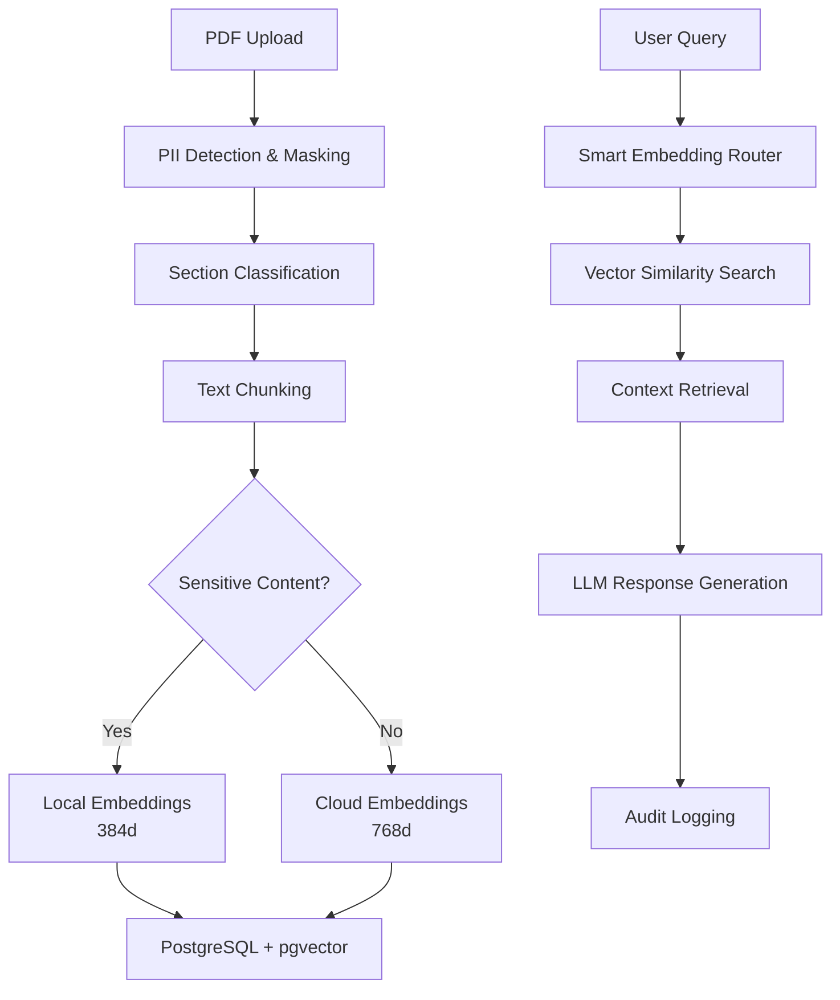

# 🏭 Industrial AI Copilot

> **Enterprise-grade RAG system for industrial environments with advanced PII protection and hybrid embedding architecture**

[](PROJECT_STATUS.md)
[](#backend-features)
[](#security-features)
[](LICENSE)

## 📋 **Overview**

Industrial AI Copilot is a secure, enterprise-ready Retrieval-Augmented Generation (RAG) system designed specifically for industrial environments. It processes technical documents, safety manuals, and operational procedures while maintaining strict data privacy and security standards.

### **🎯 Key Features**

- **🔒 Enterprise Security**: Advanced PII detection and masking using Presidio
- **🧠 Hybrid AI**: Local + Cloud embedding system for sensitive content
- **📚 Document Intelligence**: PDF processing with section classification
- **💬 Contextual Chat**: RAG-powered Q&A with source attribution
- **📊 Complete Audit**: Full logging and compliance tracking
- **🚀 Production Ready**: Scalable architecture with PostgreSQL + pgvector

---

## 🏗️ **Architecture**



---

## 🚀 **Quick Start**

### **Prerequisites**
- Node.js 18+
- Python 3.8+
- Docker Desktop
- [Gemini API Key](https://aistudio.google.com/app/apikey)
- [Groq API Key](https://console.groq.com/keys)

### **Installation**
```bash
# Clone repository
git clone <repository-url>
cd industrial-ai-copilot

# Start database
docker-compose up -d postgres

# Setup backend
cd backend
npm install
cp .env.docker .env
# Edit .env with your API keys

# Initialize database
node setup-database.js

# Start server
npm start
```

### **Test System**
```bash
# Test all components
node test-complete-system.js

# Test API endpoints
node test-api-endpoints.js
```

**📖 For detailed setup instructions, see [SETUP_GUIDE.md](SETUP_GUIDE.md)**

---

## 🔧 **API Endpoints**

### **Document Upload**
```bash
POST /upload
Headers: x-admin-key: your-admin-key
Body: form-data with 'file' field (PDF)
```

### **Chat Query**
```bash
POST /chat
Content-Type: application/json
Body: {"question": "What are the safety procedures?"}
```

### **Health Check**
```bash
GET /health
Response: {"status": "Industrial AI Copilot backend running"}
```

---

## 🛡️ **Security Features**

### **PII Protection**
- **Automatic Detection**: Identifies names, dates, IDs, phone numbers
- **Smart Masking**: Replaces sensitive data with generic tokens
- **Entity Recognition**: Advanced NLP for industrial patterns
- **Audit Trail**: Complete logging of PII handling

### **Hybrid Embedding System**
- **Local Processing**: Sensitive content processed locally (384d vectors)
- **Cloud Processing**: General content uses Gemini API (768d vectors)
- **Smart Routing**: Automatic sensitivity-based routing
- **Dimension Matching**: Query embeddings match chunk embeddings

### **Access Control**
- **Admin API Keys**: Secure document upload
- **JWT Authentication**: Token-based user sessions
- **Role-Based Access**: Admin, Editor, Viewer roles
- **Request Validation**: Input sanitization and validation

---

## 📊 **Current Status**

### **✅ Completed (75%)**
- ✅ **Backend API**: Complete with all endpoints
- ✅ **Database**: PostgreSQL + pgvector with full schema
- ✅ **Security**: PII detection, masking, and protection
- ✅ **RAG Pipeline**: Document processing to chat responses
- ✅ **Hybrid Embeddings**: Local + Cloud embedding system
- ✅ **Audit Logging**: Complete tracking and compliance
- ✅ **Testing**: Comprehensive test suite

### **🔄 In Progress (25%)**
- 🔄 **Frontend**: React.js user interface (not started)
- 🔄 **Production Deployment**: Docker Compose + SSL (partial)
- 🔄 **Documentation**: API docs and user guides (partial)

**📈 For detailed progress, see [PROJECT_STATUS.md](PROJECT_STATUS.md)**

---

## 🏭 **Industrial Use Cases**

### **Safety & Compliance**
- Safety manual Q&A
- Procedure verification
- Compliance checking
- Incident response guidance

### **Operations & Maintenance**
- Equipment troubleshooting
- Maintenance procedures
- Technical documentation
- Training materials

### **Quality & Standards**
- Standard operating procedures
- Quality control guidelines
- Certification requirements
- Best practices

---

## 🧪 **Technology Stack**

### **Backend**
- **Runtime**: Node.js 18+ with Express.js
- **Database**: PostgreSQL 16 with pgvector extension
- **AI/ML**: Gemini API, Groq API, sentence-transformers
- **Security**: Presidio, spaCy, JWT authentication
- **Processing**: PDF.js, Multer, UUID

### **NLP & AI**
- **Embeddings**: Hybrid (Local 384d + Cloud 768d)
- **LLM**: Groq (llama-3.1-8b-instant/70b-versatile)
- **PII Detection**: Microsoft Presidio
- **Text Processing**: spaCy, NLTK, transformers

### **Infrastructure**
- **Containerization**: Docker + Docker Compose
- **Database**: PostgreSQL with vector similarity search
- **Monitoring**: Built-in health checks and logging
- **Security**: Environment-based configuration

---

## 📁 **Project Structure**

```
industrial-ai-copilot/
├── backend/                 # Node.js API server
│   ├── src/
│   │   ├── routes/         # API endpoints
│   │   ├── rag/           # RAG pipeline
│   │   ├── nlp/           # NLP processing
│   │   ├── auth/          # Authentication
│   │   └── db/            # Database operations
│   ├── scripts/           # Python NLP scripts
│   ├── sql/              # Database schema
│   └── test-*.js         # Test scripts
├── frontend/             # React.js app (future)
├── docs/                # Documentation
├── docker-compose.yml   # Container orchestration
└── README.md           # This file
```

---

## 🧪 **Testing**

### **Automated Tests**
```bash
# System components
node test-complete-system.js

# API endpoints
node test-api-endpoints.js

# Database connection
node test-db-connection.js

# Local mode (no APIs)
node test-local-mode.js
```

### **Manual Testing**
- Document upload via API client
- Chat queries with various questions
- Database verification
- Performance monitoring

---

## 📚 **Documentation**

- **[SETUP_GUIDE.md](SETUP_GUIDE.md)** - Complete installation guide
- **[PROJECT_STATUS.md](PROJECT_STATUS.md)** - Current progress and roadmap
- **[REQUIREMENTS.txt](REQUIREMENTS.txt)** - System requirements
- **[DOCKER_SETUP.md](DOCKER_SETUP.md)** - Docker configuration
- **[TESTING_GUIDE.md](TESTING_GUIDE.md)** - Testing procedures

---

## 🤝 **Contributing**

### **Development Setup**
1. Follow the [SETUP_GUIDE.md](SETUP_GUIDE.md)
2. Create feature branch: `git checkout -b feature/your-feature`
3. Run tests: `npm test`
4. Submit pull request

### **Areas for Contribution**
- **Frontend Development**: React.js user interface
- **Testing**: Additional test coverage
- **Documentation**: API documentation, user guides
- **Features**: Advanced analytics, multi-language support

---

## 📄 **License**

This project is licensed under the MIT License - see the [LICENSE](LICENSE) file for details.

---

## 🆘 **Support**

### **Getting Help**
- **Setup Issues**: Check [SETUP_GUIDE.md](SETUP_GUIDE.md)
- **Troubleshooting**: See troubleshooting section in setup guide
- **API Questions**: Refer to API documentation
- **Bug Reports**: Create an issue with detailed description

### **System Requirements**
- **Hardware**: 4+ CPU cores, 8GB+ RAM, 20GB storage
- **Software**: Node.js 18+, Python 3.8+, Docker Desktop
- **APIs**: Gemini API key, Groq API key
- **Network**: Stable internet for API calls

---

## 🎯 **Roadmap**

### **Phase 25: Frontend Development** (Next)
- React.js application
- Authentication UI
- Document upload interface
- Chat interface
- Admin dashboard

### **Phase 26-28: Production Ready**
- Comprehensive testing
- Complete documentation
- Production deployment
- Monitoring and alerting

### **Phase 29: Advanced Features**
- Multi-document conversations
- Document versioning
- Advanced analytics
- API integrations

---

**🏭 Built for Industrial Excellence | 🔒 Security First | 🚀 Production Ready**

*Last Updated: January 4, 2026*